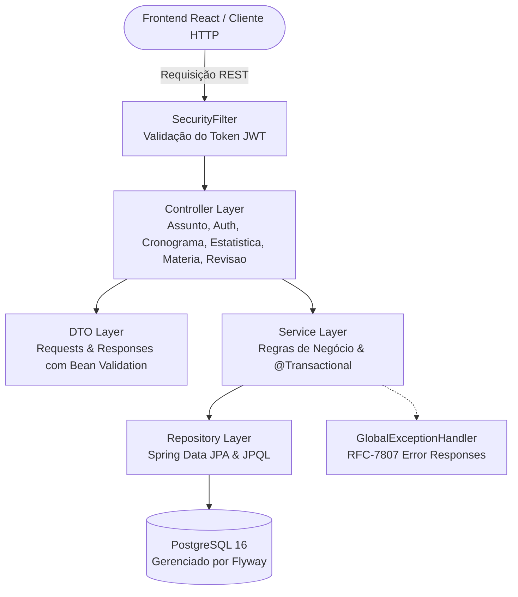
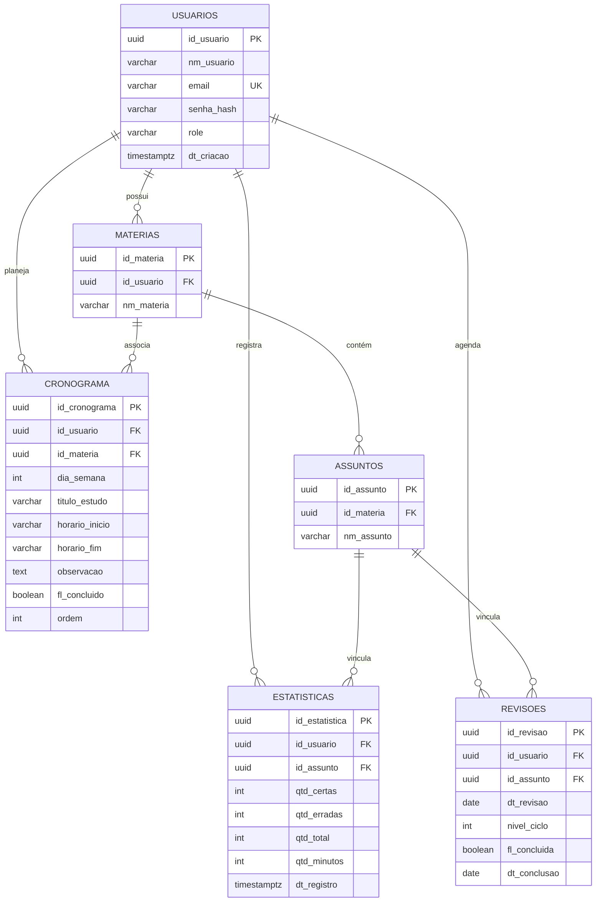

# ⚡ FocusFlow API — Backend RESTful em Spring Boot 3 & Java 21

<p align="center">
  
</p>

<p align="center">
  <strong>API RESTful robusta, transacional e containerizada desenvolvida com Spring Boot 3, Java 21, Spring Security (JWT), PostgreSQL e Flyway para o ecossistema de produtividade e estudos FocusFlow.</strong>
</p>

<p align="center">
  <a href="https://focusflow-api-snij.onrender.com/swagger-ui/index.html"></a>
  <a href="https://github.com/Crvlzin/FocusFlow"></a>
  
  
  
  
  
</p>

<p align="center">
  <a href="#-visão-geral">Visão Geral</a> •
  <a href="#%EF%B8%8F-arquitetura-do-backend">Arquitetura</a> •
  <a href="#%EF%B8%8F-modelagem-do-banco-de-dados">Banco de Dados</a> •
  <a href="#-rotas-e-endpoints-da-api">Endpoints</a> •
  <a href="#-como-executar-a-api">Como Rodar</a> •
  <a href="#-variáveis-de-ambiente">Ambiente</a> •
  <a href="#-boas-práticas--segurança">Segurança</a>
</p>

---

## 📌 Visão Geral

A **FocusFlow API** é o núcleo de serviços e persistência da plataforma [FocusFlow](https://github.com/Crvlzin/FocusFlow). A aplicação provê uma arquitetura RESTful stateless e transacional para suporte completo a:
- Autenticação e autorização seguras via **JSON Web Tokens (JWT)** com senhas criptografadas em **BCrypt**;
- Gerenciamento hierárquico de **Disciplinas e Tópicos de Estudo** com anotações e validações relacionais;
- Algoritmo de **Repetição Espaçada (Curva de Ebbinghaus)** com cálculo automatizado de estágios de revisão (D+1, D+7, D+15, D+30);
- Agendamento e ordenação de **Cronograma Semanal de Estudos** com suporte a horários e prioridades;
- Consolidação de **Estatísticas de Desempenho**, cálculo de tempo líquido, aproveitamento percentual de acertos/erros e suporte a exercícios deixados em branco.

A aplicação é 100% containerizada via **Docker multi-stage build** e possui versionamento de schema automatizado via **Flyway Migrations**.

---

## 🌐 Deploys e Links do Ecossistema

| Componente | Ambiente | URL de Acesso | Repositório |
| :--- | :--- | :--- | :--- |
| **Backend REST API** | Produção (Render) | ⚡ [https://focusflow-api-snij.onrender.com](https://focusflow-api-snij.onrender.com) | [Crvlzin/FocusFlow-api](https://github.com/Crvlzin/FocusFlow-api) |
| **Documentação Interativa** | Swagger UI / OpenAPI 3 | 📄 [Acessar Swagger UI](https://focusflow-api-snij.onrender.com/swagger-ui/index.html) | — |
| **Especificação OpenAPI** | JSON Schema | 📑 [Ver v3/api-docs](https://focusflow-api-snij.onrender.com/v3/api-docs) | — |
| **Frontend Web (Aplicação)** | Produção (Vercel) | 🔗 [https://focusflow.vercel.app](https://focusflow.vercel.app) | [Crvlzin/FocusFlow](https://github.com/Crvlzin/FocusFlow) |

---

## 🏛️ Arquitetura do Backend

A API foi projetada seguindo os princípios de **Clean Architecture** e arquitetura em camadas (**Layered N-Tier Architecture**), promovendo baixo acoplamento, alta coesão e testabilidade:



### Estrutura de Pacotes (`com.focusflow.api`)

```
src/main/java/com/focusflow/api/
├── controller/          # Endpoints REST expostos e documentados via Swagger/OpenAPI
│   ├── AssuntoController.java
│   ├── AuthController.java
│   ├── CronogramaController.java
│   ├── EstatisticaController.java
│   ├── MateriaController.java
│   └── RevisaoController.java
├── dto/                 # Data Transfer Objects com anotações de validação (@Valid)
│   ├── AuthResponse.java, LoginRequest.java, RegisterRequest.java
│   ├── MateriaRequest.java, MateriaResponse.java
│   ├── EstatisticaRequest.java, EstatisticaResponse.java, EstatisticaResumoResponse.java
│   ├── RevisaoRequest.java, RevisaoResponse.java, RevisaoGerarCiclosRequest.java
│   └── CronogramaRequest.java, CronogramaResponse.java
├── entity/              # Entidades JPA mapeadas para PostgreSQL (UUIDs nativos)
│   ├── Usuario.java, Materia.java, Assunto.java
│   ├── Estatistica.java, Revisao.java, Cronograma.java
├── exception/           # Manipulação global de erros (@RestControllerAdvice)
│   └── GlobalExceptionHandler.java
├── repository/          # Interfaces Spring Data JPA para acesso a dados
│   ├── UsuarioRepository.java, MateriaRepository.java, AssuntoRepository.java
│   ├── EstatisticaRepository.java, RevisaoRepository.java, CronogramaRepository.java
├── security/            # Segurança stateless JWT e controle de CORS
│   ├── SecurityConfig.java
│   ├── SecurityFilter.java
│   └── TokenService.java
└── service/             # Regras de negócio e consistência transacional
    ├── AuthService.java, MateriaService.java, AssuntoService.java
    ├── EstatisticaService.java, RevisaoService.java, CronogramaService.java
```

---

## 🗄️ Modelagem do Banco de Dados

O banco de dados relacional utiliza **PostgreSQL 16** com versionamento estrito por meio de **Flyway**. As migrações executam automaticamente no início da aplicação:
- `V1__create_initial_schema.sql`: Criação das tabelas centrais, chaves primárias UUID e índices.
- `V2__alter_qtd_total.sql`: Desacoplamento de coluna gerada para suporte nativo a questões em branco.

### Diagrama Entidade-Relacionamento (ERD)



---

## 📡 Rotas e Endpoints da API

A documentação interativa completa via Swagger pode ser acessada em:
👉 **[Swagger UI Interativo](https://focusflow-api-snij.onrender.com/swagger-ui/index.html)** *(ou `/swagger-ui/index.html` em execução local)*.

### 🔐 Autenticação (`/auth`)
| Método | Endpoint | Descrição | Auth |
| :--- | :--- | :--- | :---: |
| `POST` | `/auth/register` | Cria um novo usuário com senha hasheada (BCrypt) e retorna o JWT | ❌ Pública |
| `POST` | `/auth/login` | Valida credenciais (e-mail e senha) e gera token JWT | ❌ Pública |
| `GET` | `/auth/me` | Retorna os dados do usuário autenticado a partir do token | 🔒 Bearer |

### 📚 Matérias & Assuntos (`/materias`, `/assuntos`)
| Método | Endpoint | Descrição | Auth |
| :--- | :--- | :--- | :---: |
| `GET` | `/materias` | Lista as matérias e tópicos do usuário logado | 🔒 Bearer |
| `POST` | `/materias` | Cria uma nova matéria | 🔒 Bearer |
| `DELETE`| `/materias/{id}` | Remove a matéria e seus tópicos em cascata | 🔒 Bearer |
| `POST` | `/assuntos` | Adiciona um assunto a uma matéria existente | 🔒 Bearer |
| `DELETE`| `/assuntos/{id}` | Remove o assunto específico | 🔒 Bearer |

### 🔄 Revisões Espaçadas (`/revisoes`)
| Método | Endpoint | Descrição | Auth |
| :--- | :--- | :--- | :---: |
| `GET` | `/revisoes` | Lista revisões (com filtros de data ou status) | 🔒 Bearer |
| `GET` | `/revisoes/resumo` | Retorna sumário (hoje, atrasadas, pendentes, concluídas) | 🔒 Bearer |
| `POST` | `/revisoes` | Cadastra uma revisão manual | 🔒 Bearer |
| `POST` | `/revisoes/gerar-ciclos` | Gera automaticamente a cadeia completa de 4 ciclos (24h, 7d, 15d, 30d) | 🔒 Bearer |
| `PATCH`| `/revisoes/{id}/concluir` | Marca a revisão como realizada e registra data de conclusão | 🔒 Bearer |
| `PATCH`| `/revisoes/{id}/reiniciar`| Reinicia a revisão para o estado pendente | 🔒 Bearer |
| `DELETE`| `/revisoes/{id}` | Exclui uma revisão | 🔒 Bearer |

### 📊 Estatísticas & Analytics (`/estatisticas`)
| Método | Endpoint | Descrição | Auth |
| :--- | :--- | :--- | :---: |
| `GET` | `/estatisticas` | Lista histórico detalhado de sessões de estudo | 🔒 Bearer |
| `GET` | `/estatisticas/resumo` | Métricas consolidadas (tempo total, acertos, taxa geral) | 🔒 Bearer |
| `POST` | `/estatisticas` | Registra nova sessão (tempo de foco, acertos, erros, total) | 🔒 Bearer |
| `DELETE`| `/estatisticas/{id}` | Remove um registro específico de sessão | 🔒 Bearer |
| `DELETE`| `/estatisticas/historico` | Limpa todo o histórico de métricas do usuário | 🔒 Bearer |

### 📅 Cronograma Semanal (`/cronograma`)
| Método | Endpoint | Descrição | Auth |
| :--- | :--- | :--- | :---: |
| `GET` | `/cronograma` | Lista blocos de estudo organizados pela semana | 🔒 Bearer |
| `POST` | `/cronograma` | Adiciona bloco a um dia da semana (0 = Dom, 6 = Sáb) | 🔒 Bearer |
| `PUT` | `/cronograma/{id}` | Atualiza título, horários ou status de conclusão | 🔒 Bearer |
| `PUT` | `/cronograma/reordenar` | Reordena a sequência prioritária dos blocos | 🔒 Bearer |
| `DELETE`| `/cronograma/{id}` | Remove o bloco do cronograma | 🔒 Bearer |

---

## 💻 Como Executar a API

### Opção 1: Via Docker Compose (Mais Rápido e Recomendado)

Suba o banco de dados PostgreSQL e a API simultaneamente com um único comando:

```bash
docker compose up -d
```

A API estará disponível imediatamente em: `http://localhost:8080`.
Acesse a documentação: `http://localhost:8080/swagger-ui/index.html`.

Para parar os serviços:
```bash
docker compose down
```

---

### Opção 2: Execução Local com Maven

#### Pré-requisitos
- **Java 21 JDK** instalado (`java -version`)
- Instância do **PostgreSQL** rodando (localmente ou via `docker compose up postgres -d`)

#### Passo a Passo
1. **Clone o repositório:**
   ```bash
   git clone https://github.com/Crvlzin/FocusFlow-api.git
   cd FocusFlow-api
   ```

2. **Configure o arquivo de ambiente:**
   Copie o modelo de variáveis:
   ```bash
   cp .env.example .env
   ```

3. **Compile e inicie a aplicação:**
   - No Windows (PowerShell):
     ```powershell
     .\mvnw.cmd spring-boot:run
     ```
   - No Linux / macOS:
     ```bash
     ./mvnw spring-boot:run
     ```

4. **Execução de testes:**
   ```bash
   ./mvnw test
   ```

---

## ⚙️ Variáveis de Ambiente

As propriedades da aplicação podem ser customizadas via variáveis de ambiente ou arquivo `.env`:

| Variável | Padrão Local | Descrição |
| :--- | :--- | :--- |
| `PORT` | `8080` | Porta onde o servidor HTTP escuta |
| `SPRING_DATASOURCE_URL` | `jdbc:postgresql://localhost:5432/focusflow_db` | URL de conexão JDBC com o banco |
| `SPRING_DATASOURCE_USERNAME`| `postgres` | Usuário do banco PostgreSQL |
| `SPRING_DATASOURCE_PASSWORD`| `password123` | Senha do banco PostgreSQL |
| `API_SECURITY_TOKEN_SECRET` | `focusflow-super-secret-key-...` | Chave criptográfica HMAC-256 para JWT |
| `TOKEN_EXPIRATION_HOURS` | `24` | Tempo de validade do token em horas |
| `CORS_ALLOWED_ORIGINS` | `http://localhost:5173,https://focusflow.vercel.app` | Origens permitidas para requisições CORS |

---

## 🛡️ Boas Práticas & Segurança

- **Stateless Authentication**: Sessões de usuário não ocupam memória do servidor, viabilizando escalabilidade horizontal.
- **Hash de Senhas com BCrypt**: Proteção contra ataques de dicionário e tabelas rainbow via salt e hashing de fator de custo padrão.
- **Filtro de Segurança Customizado**: `SecurityFilter` estende `OncePerRequestFilter`, garantindo injeção controlada de contexto no `SecurityContextHolder`.
- **Validação de Entrada Estrita**: Todos os payloads de entrada passam pelo Hibernate Validator (`@Valid`), garantindo tipos, tamanhos e e-mails válidos antes de atingir a camada de serviço.
- **Tratamento Global de Exceções**: Respostas de erro padronizadas contendo timestamp, código HTTP e mapeamento amigável de campos inválidos.
- **Isolamento de Domínio (DTO Pattern)**: Entidades JPA nunca são expostas diretamente em retornos de controladores REST.

---

## 🔗 Repositório Relacionado

Esta API alimenta a interface web:
- 💻 **[FocusFlow Web (React 19 + TypeScript + Vite)](https://github.com/Crvlzin/FocusFlow)**

---

## 👨‍💻 Autor

Desenvolvido por **Gabriel Carvalho** (@Crvlzin).
- GitHub: [@Crvlzin](https://github.com/Crvlzin)
- Demonstração Web: [FocusFlow na Vercel](https://focusflow.vercel.app)

---

## 📄 Licença

Este projeto é distribuído sob a licença **MIT**. Consulte o arquivo `LICENSE` para mais detalhes.
